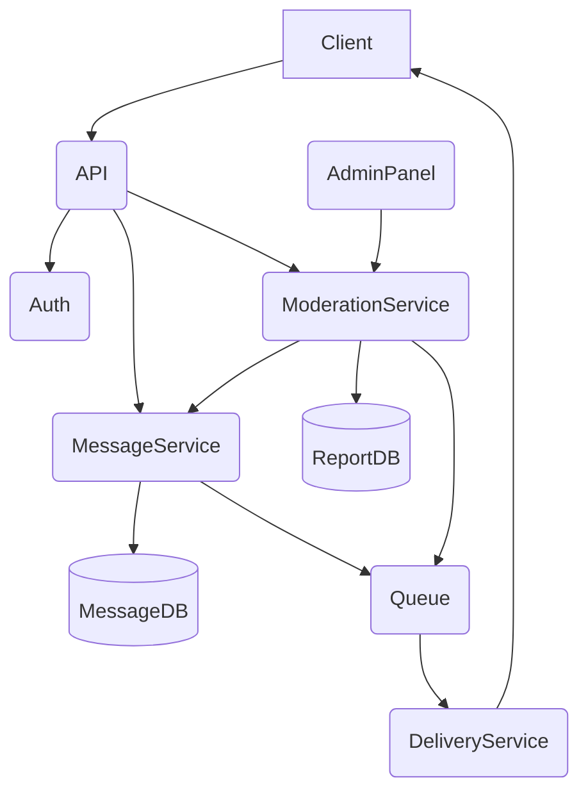
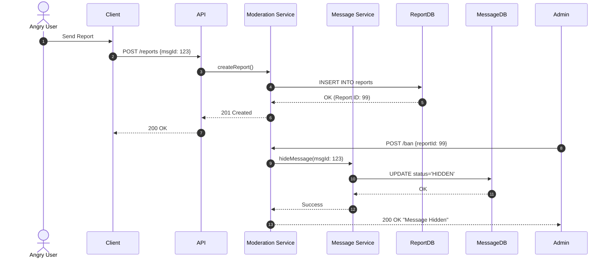
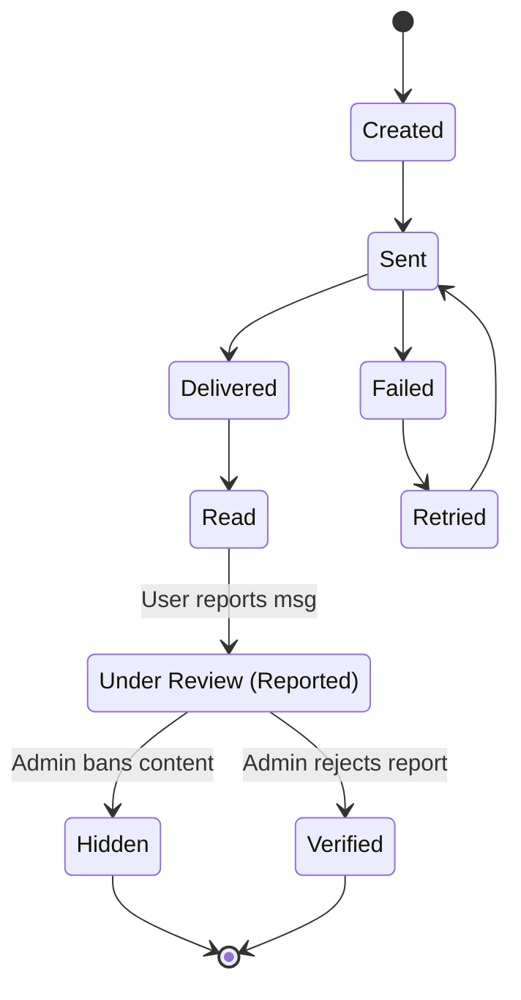

# Messenger API 🚀

A robust RESTful API for real-time messaging with an integrated content moderation system. Built as part of a software engineering laboratory project.

## 🛠 Tech Stack

- **Runtime:** Node.js
- **Language:** TypeScript
- **Framework:** Express.js
- **Database:** PostgreSQL
- **Containerization:** Docker & Docker Compose
- **Testing:** Postman / Jest (In Progress)

---

## 🚀 Getting Started

### 1. Prerequisites

Ensure you have [Node.js](https://nodejs.org/) and [Docker](https://www.docker.com/) installed on your machine.

### 2. Install Dependencies

```
npm install
```

### 3. Environment Setup

Create a .env file in the root directory and configure your credentials:

```
DB_HOST=localhost
DB_PORT=5432
DB_USER=Top
DB_PASSWORD=12345
DB_NAME=MessengerDb
PORT=3000
```

### 4. Infrastructure (Docker)

Spin up the PostgreSQL instance:

```
docker compose up -d
```

### 5. Run the Server

The database schema will be initialized automatically on startup:

```
npx tsx backend/src/main.ts
```

The API will be available at: http://localhost:3000

---

## 📡 API Endpoints

Messaging & Users

- POST /api/users — Register a new user
- POST /api/conversations — Create a new chat session
- POST /api/messages — Send a message

- GET /api/messages/:conversationId — Retrieve message history

Moderation (Feature in Progress)

- POST /api/reports — Report a specific message for review
- POST /api/moderation/ban — Administrative action to hide content

---

## 🏗 System Architecture

Component Diagram



Moderation Workflow (Sequence)



Message Life Cycle (State)


