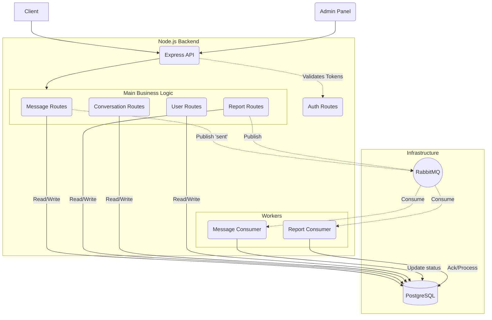
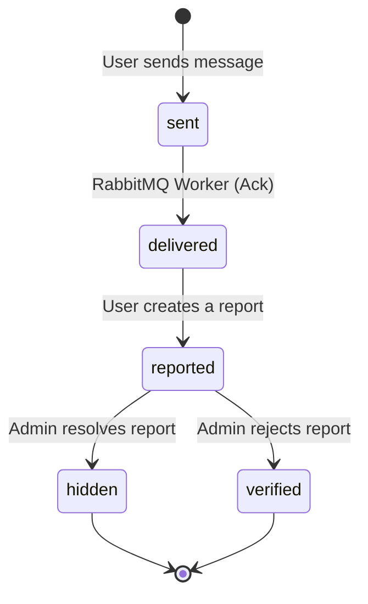

# Messenger API 🚀

A robust RESTful API for real-time messaging with an integrated content moderation system. Built as part of a software engineering laboratory project.

## 🛠 Tech Stack

- **Runtime:** Node.js
- **Language:** TypeScript
- **Framework:** Express.js
- **Database:** PostgreSQL
- **Containerization:** Docker & Docker Compose
- **Queue**: RabbitMQ
- **Testing:** Postman / Jest (In Progress)

---

## 🚀 Getting Started

### 1. Prerequisites

Ensure you have [Node.js](https://nodejs.org/), [Docker](https://www.docker.com/) and [RabbitMQ](https://www.rabbitmq.com/) installed on your machine.

### 2. Install Dependencies

```
npm install
```

### 3. Environment Setup

Create a .env file in the root directory based on .env.example and configure your local credentials.

### 4. Infrastructure (Docker)

Spin up the infrastructure (PostgreSQL & RabbitMQ):

```
docker compose up -d
```

### 5. Run the Server

The database schema will be initialized automatically on startup:

```
npx tsx backend/src/main.ts
```

The API will be available at: http://localhost:3000

---

## 📡 API Endpoints

Messaging & Users

- POST /api/users — Register a new user
- POST /api/conversations — Create a new chat session
- POST /api/messages — Send a message

- GET /api/messages/:conversationId — Retrieve message history in certain conversation

Moderation

- POST /api/reports — Report a specific message for review
- PUT /api/reports/:reportId/take — Take report by administrator
- PUT /api/reports/:reportId/resolve - Resolve report and hide reported message
- PUT /api/reports/:reportId/reject - Reject report and make reported message verified

- GET /api/reports - List all unsolved reports
---

## 🏗 System Architecture

Component Diagram



Moderation Workflow (Sequence)

```mermaid
sequenceDiagram
    autonumber

    actor User as Angry User
    participant Client
    participant API as Express API
    participant Service as Report Service
    participant DB as PostgreSQL
    participant MQ as RabbitMQ
    participant AP as Admin Panel
    actor Admin

    User->>Client: Report a message
    Client->>API: POST /api/reports {messageId, ...}
    API->>Service: createReport(...)
    
    rect rgb(60, 60, 60)
    Note right of Service: SQL Transaction (BEGIN)
    Service->>DB: Verify message, user, conversation
    Service->>DB: INSERT INTO reports
    Service->>DB: UPDATE messages SET status = 'reported'
    DB-->>Service: COMMIT (OK)
    end
    
    Service->>MQ: Publish 'REPORT_CREATED' to report_queue
    Service-->>API: "Your report was created successfully."
    API-->>Client: 201 Created {message}
    Client-->>User: Success UI Notification

    Admin->>AP: Open unsolved reports
    AP->>API: GET /api/reports?status=unsolved
    API->>Service: getReports('unsolved')
    Service->>DB: SELECT * FROM reports WHERE status='unsolved'
    DB-->>Service: reports array
    Service-->>API: reports array
    API-->>AP: 200 OK [reports]
    AP-->>Admin: Show list of reports

    Admin->>AP: Take report in work
    AP->>API: PUT /api/reports/{reportId}/take
    API->>Service: takeReportInWork(reportId)
    Service->>DB: UPDATE reports SET status='solving'
    DB-->>Service: OK
    Service-->>API: "Report {id} marked as 'solving'."
    API-->>AP: 200 OK {message}
    AP-->>Admin: Update UI status

    Admin->>AP: Review report content
    
    alt Verdict: Resolve
        AP->>API: PUT /api/reports/{reportId}/resolve
        API->>Service: resolveAndHideMessage()
        Service->>DB: BEGIN: Update message='hidden', report='solved', COMMIT
        DB-->>Service: OK
        Service-->>API: success message
        API-->>AP: 200 OK
        AP-->>Admin: "Message was hidden"
    else Verdict: Reject
        AP->>API: PUT /api/reports/{reportId}/reject
        API->>Service: rejectReport()
        Service->>DB: BEGIN: Update message='verified', report='solved', COMMIT
        DB-->>Service: OK
        Service-->>API: success message
        API-->>AP: 200 OK
        AP-->>Admin: "Message was verified"
    end
```



Message Life Cycle (State)


